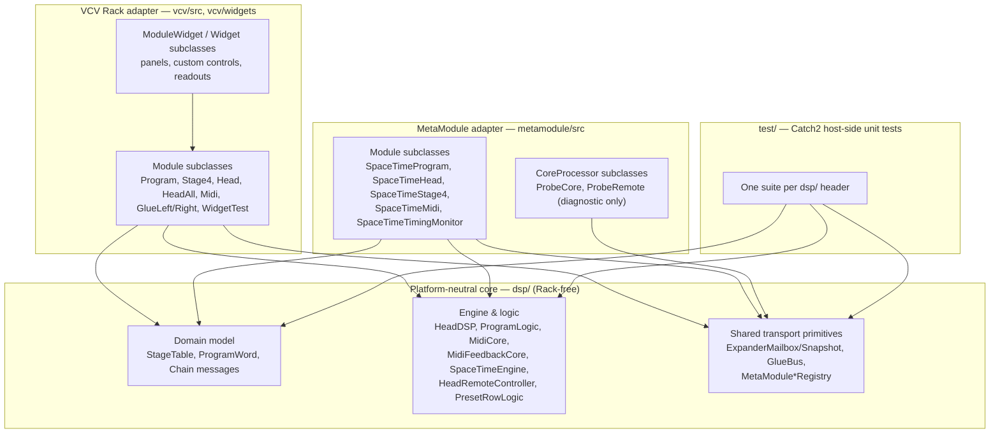
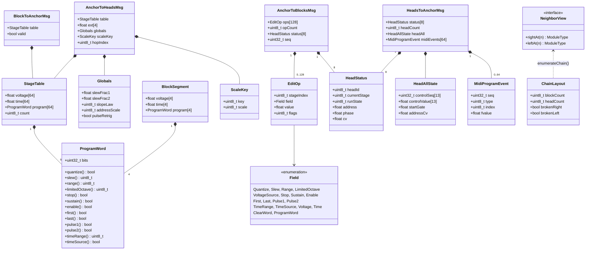
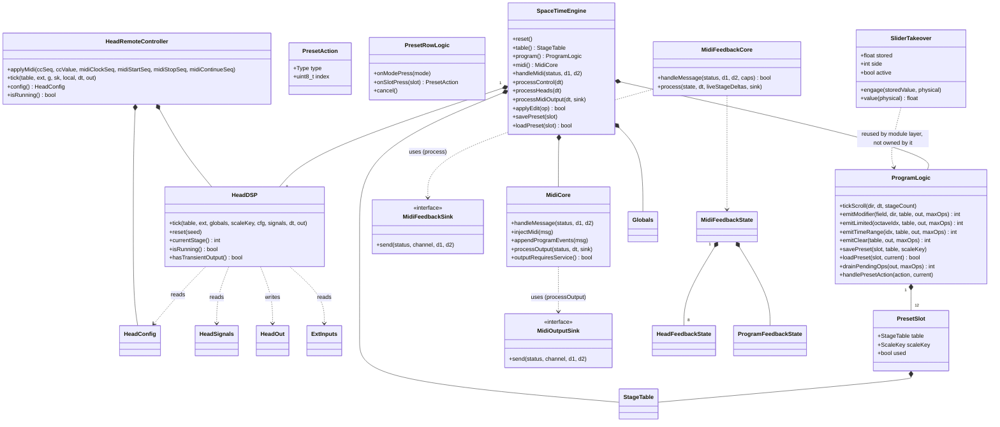
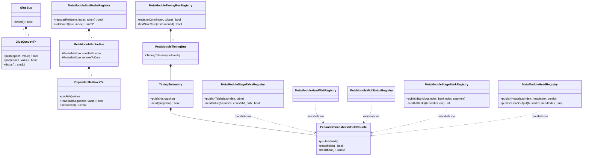
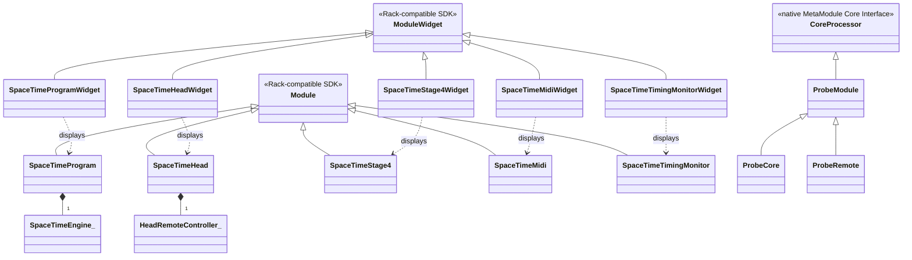

# SpaceTime — Plugin Architecture & Software Design Document

**Scope:** technical/source-level architecture of the SpaceTime plugin family (VCV Rack + MetaModule), current as of the checked-out state on 2026-08-17. Product/manual documentation lives in `README.md`; hardware-interpretation rationale lives in `marf-vcv-plan.md` and `marf-vcv.md`. This document covers only the C++ source architecture: module inventory, inter-module communication, class structure (UML), and a file-by-file inventory.

---

## 1. System overview

SpaceTime is a Buchla 248t "MARF" (Multiple Arbitrary Function Generator) reinterpretation, shipped as two sibling plugins built from one shared codebase:

- **VCV Rack** (`vcv/`) — a family of physically-adjacent, expander-chained modules (`PROGRAM`, `STAGE4`, `HEAD`, `HEAD ALL`, `MIDI`, plus the `GLUE LEFT`/`GLUE RIGHT` bridge pair and a hidden dev module).
- **MetaModule** (`metamodule/`) — a hardware target (Cortex-A7 embedded Rack-API clone) with a different physical constraint: modules cannot rely on panel-adjacency expander links, so the equivalent modules communicate over lock-free shared-memory buses instead, and are bound to each other by an "Instrument ID" rather than by being plugged next to one another.

Both targets are thin adapters over one **platform-neutral domain/engine core** (`dsp/`), which contains no Rack SDK includes and is unit-tested standalone (`test/`, Catch2 — 17 suites / ~3000 assertions as of the last recorded run).

### 1.1 Architectural principles

- **Rack-free core.** Every header in `dsp/` is checked, by convention and review, to include only `<cstdint>`/`<cmath>`/`<atomic>`/`<cstring>` — never `rack.hpp`. This is what lets one engine back two unrelated SDKs and be tested on the host without either.
- **Two transports, one wire format.** VCV modules exchange the same C++ structs (`BlockToAnchorMsg`, `AnchorToHeadsMsg`, `HeadsToAnchorMsg`, `AnchorToBlocksMsg`, `StageTable`, `BlockSegment`) over Rack's double-buffered expander ports; MetaModule modules exchange the *same domain data* (stage tables, head configs, MIDI CC rows) over lock-free seqlock/mailbox buses in shared plugin memory (`MetaModuleRemoteBus.hpp`), because MetaModule modules cannot assume panel adjacency.
- **Blocks/heads own their data; the anchor never overwrites it.** `PROGRAM` (VCV) / `SpaceTimeProgram` (MetaModule) is an *anchor* that emits edit-ops; `STAGE4` blocks own their program words and slider values and apply ops addressed to them.
- **Append-only wire formats.** `Field` (program-word bit layout) and the JSON persistence schema are append-only by convention — existing bit positions/enum values must never change or be renumbered, since they travel over the expander wire and live in saved patches.
- **Slug parity across targets, by explicit product decision.** The MetaModule modules reuse the VCV modules' slugs (`Program`, `Stage4`, `Head`, `Midi`) even though their internal mechanics differ substantially (bus-bound vs. expander-chained, fused vs. distributed). This is deliberate — see §5.3.

---

## 2. Top-level plugins and modules

### 2.1 VCV Rack plugin `SpaceTime` (brand: Kurkesmurfer)

Manifest: `vcv/plugin.json`. All panels are 128.5 mm tall (3U); widths below are read from the panel SVG `viewBox` (1 HP = 5.08 mm).

| Slug | Class (`vcv/src/`) | HP | Params | Inputs | Outputs | Lights | Role |
|---|---|---|---|---|---|---|---|
| `Program` | `Program` | 18 | 40 | 4 (EXT A–D) | 1 (poly) | 40 | Programming-section **anchor**: stage select/scroll, 12 modifier gestures, Limited-octave bank, time-range bank, Clear, 12-slot preset row (Load/Save/Key/Scale), pulse-retrigger switch, key/scale/globals. Broadcasts the merged table + EXT inputs + globals to the HEAD chain; emits edit-ops to the STAGE4 chain; merges head statuses onto POLY OUT. |
| `Stage4` | `Stage4` | 10 | 8 (4×voltage, 4×time sliders) | 0 | 0 | 100 (4 edit-select + 4×8 RGB head-position dots) | One 4-stage **block**. Owns its program words and slider values; applies edit-ops addressed to it; relays the block-to-block table chain and the anchor-to-blocks op/status chain; renders stage-annotation readouts (note name/cents/duration). Chainable right of PROGRAM, up to 16 blocks (64 stages). |
| `Head` | `Head` | 10 | 13 | 8 | 7 | 7 | One Function Generator **playhead** (`dsp::HeadDSP`, ticked at audio rate). Transport (Start/Stop/Advance/Reset/Strobe), addressing (knob/CV, Strobe/Sequential/Continuous), direction, clock source/division, loop mode, FG Display arbitration. Chainable left of PROGRAM, up to 8 heads. |
| `HeadAll` | `HeadAll` | 10 | 12 | 8 | 0 | 1 | Common transport/playback/CV **control source** injected at the far-left end of the HEAD chain; contributes no playhead or signal output itself. Edge-safe common inputs and persistent panel state travel rightward with head statuses. |
| `Midi` | `Midi` | 4 | 0 | 0 (Rack MIDI device widget) | 0 | 3 | **MIDI gateway**: clock/transport, preset recall, per-stage/per-head CC control, outgoing note/CC per head, and a bidirectional DROID-controller feedback protocol. Adapter around `dsp::MidiCore` + `dsp::MidiFeedbackCore`. Chains transparently into the HEAD side (no hop increment). |
| `GlueLeft` | `GlueLeft` : `GlueEndpoint` | 2 | 0 | 0 | 0 | 2 | Virtual expander **bridge**, right-hand fragment. Paired with a same-numbered `GlueRight` elsewhere in the rack via a lock-free `GlueBus`, so a HEAD-side fragment and a PROGRAM/STAGE4-side fragment need not be panel-adjacent. |
| `GlueRight` | `GlueRight` : `GlueEndpoint` | 2 | 0 | 0 | 0 | 2 | Same mechanism, left-hand fragment. |
| `WidgetTest` (hidden) | `WidgetTest` | — | 23 | 0 | 0 | ≥29 | Dev-only exerciser for every custom widget (spring switches, LED cluster, Limited bank, preset row). Not shown in the module browser; not for patches. |

### 2.2 MetaModule plugin `SpaceTime`

Manifest: `metamodule/plugin.json`. MetaModule modules are **not** expander-chained; they bind to each other over shared plugin memory by **Instrument ID** (`MetaModuleRemoteBus.hpp` registries), addressed via an `INSTRUMENT_PARAM` knob on each module.

| Slug | Class (`metamodule/src/`) | Role |
|---|---|---|
| `Program` | `SpaceTimeProgram` | **Fused** engine module: owns the full 64-stage table, MIDI ingestion, key/scale, presets and all 21 VCV-equivalent programming controls directly (via `dsp::SpaceTimeEngine`), *plus* a 4-channel polyphonic CV output (heads 1–4 only — MetaModule's `Port` caps at `PORT_MAX_CHANNELS = 4`, vs. VCV's single 8-channel `POLY_OUTPUT`). Publishes the table/context/per-head MIDI over the EB (Expander Bus) registries for `Head`/`Stage4`/`Midi` peers to read. |
| `TimingMonitor` | `SpaceTimeTimingMonitor` | Diagnostic-only: read-only clock-to-stage timing monitor for all eight heads, bound to an Instrument ID, reading `MetaModuleTimingBusRegistry`. |
| `Head` | `SpaceTimeHead` | **Relocated** head: runs its own `dsp::HeadRemoteController`-wrapped `HeadDSP` instance (EB8), reading the table/context/CC broadcast from `Program` over the bus and reporting its output back. Same slug as VCV's `Head`; mechanics differ (bus-bound, not chained). Full param/jack parity with VCV `Head` (14 params incl. `INSTRUMENT`/`HEAD` select, 8 inputs, 7 outputs). |
| `Stage4` | `SpaceTimeStage4` | **Thin publisher**: owns no data — "the metamodule variant of Program contains all stages as well ... Stage4 only visualises the stages." Publishes its bank's 4 voltage/time sliders to `Program` over `MetaModuleStageBankRegistry`; reads `Program`'s table back purely to display note/duration annotations. |
| `Midi` | `SpaceTimeMidi` | **Read-only monitor**: no device queues of its own; reads `MetaModuleMidiStatusRegistry` for whatever `Program` already tracks. VCV's `Midi` owns real device I/O and DROID feedback; this one does not. |
| `BusProbeCore` / `BusProbeRemote` | `ProbeCore` / `ProbeRemote` : `ProbeModule` : `CoreProcessor` | **Disposable diagnostic pair** built directly on MetaModule's native `CoreProcessor` interface (bypassing the Rack-compatibility `Module` layer entirely) — verifies the shared-memory transport primitives on real hardware, including which physical core (AArch32 Cortex-A7) each instance runs on. Not part of the musical instrument. |

### 2.3 Naming convention: slug parity, differing mechanics

Per explicit product direction recorded in the MetaModule sources: *"The metamodule parallel MUST have the same slug ... that the mechanics are all different is irrelevant, as that does not show up in the yml."* Consequently `vcv::Program` and `metamodule::SpaceTimeProgram` are **unrelated C++ types** that happen to expose the same user-facing slug `Program` — one is a thin plumbing layer over neighbours; the other is a fused, self-contained engine. The same is true for `Head`/`SpaceTimeHead`, `Stage4`/`SpaceTimeStage4`, and `Midi`/`SpaceTimeMidi`. This document keeps the two class hierarchies (§4.4, §4.5) strictly separate for that reason.

---

## 3. Inter-module communication

### 3.1 VCV expander chain protocol (`dsp/Chain.hpp`)

Modules are placed contiguously: `[HEAD]...[HEAD][HEAD ALL?][MIDI?][PROGRAM][STAGE4]...[STAGE4]`. The protocol is **self-organizing** — no module needs global knowledge of the chain:

- Leftward **block tables** build by *prepending* each block's own segment onto the table received from its right neighbour, so the block nearest PROGRAM holds the lowest stage indices.
- **Module/head indices** derive purely from hop counters incremented at every relay (`headRelayLeft`, `blockRelayRight`, …) — nothing is globally numbered.
- Rightward **head statuses** merge by *appending* at each hop (farthest head first, nearest last).
- Latency is exactly one control-rate tick per hop. A gap or foreign module terminates the chain on that side; `PROGRAM` separately runs `enumerateChain()` (pure, over the `NeighborView` interface) to detect and warn about broken/overlong chains for its stage-count display.

| Message | Direction | Carries |
|---|---|---|
| `BlockToAnchorMsg` | block → left neighbour | this block's + all rightward blocks' `StageTable` |
| `AnchorToHeadsMsg` | anchor → heads (relayed head-to-head) | full `StageTable`, EXT A–D, `Globals`, `ScaleKey`, selected stage, Display arbitration, MIDI clock/CC broadcast |
| `HeadsToAnchorMsg` | head → right neighbour (relayed) | merged `HeadStatus[8]`, `HeadAllState`, queued `MidiProgramEvent[64]` |
| `AnchorToBlocksMsg` | anchor → blocks (relayed) | `EditOp[128]` batch, selected stage, merged `HeadStatus[8]` (for position dots), apply-once `seq` |

`vcv/src/ChainAdapter.hpp` is the *only* place that touches Rack's `leftExpander`/`rightExpander` plumbing: `MessagePort<T>` owns the double buffer on the receiving side (allocated in the module constructor, per Rack/Fundamental convention), and `RackNeighborView : NeighborView` implements chain enumeration by walking `Module::model` pointers.

### 3.2 VCV Glue bus — bridging non-adjacent fragments

`GlueLeft`/`GlueRight` (`vcv/src/Glue.cpp`) let a patcher split the HEAD-side fragment and the PROGRAM/STAGE4-side fragment across non-adjacent rack space. Each pair claims a numbered slot (1–8) in a process-global `GlueRegistry` of `GlueBus` instances; each `GlueBus` carries four single-producer/single-consumer `GlueQueue<T>` ring buffers (one per message type per direction), epoch-tagged so stale envelopes from an earlier pairing are dropped automatically.

### 3.3 MetaModule shared-memory buses (Expander Bus / "EB" plan)

Because MetaModule modules cannot rely on physical adjacency, the equivalent transport is a set of **lock-free registries** living in shared plugin memory (one real definition per registry, `extern`-declared via `metamodule/src/RemoteBus.hpp` / `TimingBus.hpp` so every module `.cpp` in the plugin binary shares the same instances):

| Registry (`dsp/MetaModule*.hpp`) | Publishes | Consumed by |
|---|---|---|
| `MetaModuleBusProbeRegistry` | exclusive-owner Core/Remote/aux-role slots + a float mailbox each way | `BusProbeCore`/`BusProbeRemote` (diagnostic only) |
| `MetaModuleTimingBusRegistry` | per-instrument `TimingSnapshot` (8-head source/stage/run-state/clock telemetry) | `SpaceTimeTimingMonitor`; also `findSoleCore()` for auto-bind |
| `MetaModuleStageTableRegistry` | the full `StageTable` + `ExtInputs` context | `SpaceTimeHead` (EB8) |
| `MetaModuleHeadMidiRegistry` / `MetaModuleMidiStatusRegistry` | per-head MIDI CC rows / MIDI status snapshot | `SpaceTimeHead`, `SpaceTimeMidi` |
| `MetaModuleStageBankRegistry` | one `BlockSegment` (4 stages) per bank index | `SpaceTimeStage4` publishes, `SpaceTimeProgram` reads/arbitrates |
| `MetaModuleHeadRegistry` | per-head `HeadConfig` in, `HeadOut` back | future per-head relocation (EB8), exclusive-owner claim per head slot |

Two primitive shapes underlie all of the above (`dsp/ExpanderLink.hpp`), deliberately kept distinct rather than unified:

- **`ExpanderMailbox<T>`** — change-tracked single word (sequence counter; reader learns *whether* a new value arrived).
- **`ExpanderSnapshot<kFieldCount>`** — always-current multi-field seqlock (reader always gets the latest coherent value, changed or not); typed wrappers (`TimingTelemetry`, the registries above) marshal real fields into/out of its flat `uint32_t` array.

---

## 4. Class diagrams (UML)

### 4.1 Domain data model — `dsp/StageTable.hpp`, `dsp/Chain.hpp`

*`apply()`, `setProgramField()`/`getProgramField()`, `concatenate()`, `blockRelayLeft/Right()`, `headRelayLeft/Right()`, `pushOp()`, `applyOpsToSegment()` are free functions operating on these types, not methods — kept that way so the wire format stays a plain, trivially-copyable POD layout (a hard requirement: these structs live in double-buffered expander memory).*

### 4.2 Platform-neutral engine & logic layer — `dsp/*.hpp`

*`SpaceTimeEngine` is the fused single-instrument owner used by MetaModule's `SpaceTimeProgram`; `HeadRemoteController` is a deliberate, tested near-duplicate of `SpaceTimeEngine`'s per-head MIDI-to-signal translation, factored out for MetaModule's relocatable `SpaceTimeHead` rather than refactored into `SpaceTimeEngine` in place — kept in sync by `HeadRemoteControllerTest.cpp` proving byte-identical behaviour against `SpaceTimeEngine`'s own path for the same CC stream. `SliderTakeover` is instantiated per-slider by the module layer (`Stage4`, `SpaceTimeStage4`), not owned by `ProgramLogic`.*

### 4.3 Shared-memory transport primitives — `dsp/ExpanderLink.hpp`, `GlueBus.hpp`, `MetaModule*.hpp`

*`ProbeMailbox` is a type alias (`using ProbeMailbox = ExpanderMailbox<float>`), not a subclass. All six `MetaModule*Registry` classes follow the same shape (`kBusCount = 4` instrument slots, CAS-based exclusive-owner tokens, `makeToken()`/`registerX()`/`tryClaimX()`/`unregisterX()`) — `MetaModuleBusProbeRegistry` is the generalized original; the later ones are purpose-specific siblings rather than a shared template, by deliberate choice (documented in-source as deferred generalization pending a second real consumer).*

### 4.4 VCV Rack module & widget hierarchy — `vcv/src/`, `vcv/widgets/`

```mermaid
classDiagram
    class Module { <<Rack SDK: rack::engine::Module>> }
    class ModuleWidget { <<Rack SDK: rack::app::ModuleWidget>> }
    class Widget { <<Rack SDK>> }
    class SvgSwitch { <<Rack SDK: app::SvgSwitch>> }
    class SvgPanel { <<Rack SDK: app::SvgPanel>> }
    class SvgWidget { <<Rack SDK>> }

    Module <|-- Program
    Module <|-- Stage4
    Module <|-- Head
    Module <|-- HeadAll
    Module <|-- Midi
    Module <|-- GlueEndpoint
    Module <|-- WidgetTest
    GlueEndpoint <|-- GlueLeft
    GlueEndpoint <|-- GlueRight

    ModuleWidget <|-- ProgramWidget
    ModuleWidget <|-- Stage4Widget
    ModuleWidget <|-- HeadWidget
    ModuleWidget <|-- HeadAllWidget
    ModuleWidget <|-- MidiWidget
    ModuleWidget <|-- WidgetTestWidget
    ModuleWidget <|-- GlueWidget~TModule~
    GlueWidget~TModule~ <|-- GlueLeftWidget
    GlueWidget~TModule~ <|-- GlueRightWidget

    Widget <|-- PanelText
    PanelText <|-- RotatedPanelText
    PanelText <|-- ManufacturerWordmark
    SvgPanel <|-- ThemedPanel
    SvgWidget <|-- CornerMark
    Widget <|-- StageCountDisplay
    Widget <|-- GlueReadout
    Widget <|-- MidiReadout
    Widget <|-- Stage4_StageAnnotationWidget

    SvgSwitch <|-- SpringSwitch3
    SpringSwitch3 <|-- LatchSpringSwitch3
    SvgSwitch <|-- Switch4

    ProgramWidget ..> Program : displays
    Stage4Widget ..> Stage4 : displays
    HeadWidget ..> Head : displays
    HeadAllWidget ..> HeadAll : displays
    MidiWidget ..> Midi : displays
    GlueLeftWidget ..> GlueLeft : displays
    GlueRightWidget ..> GlueRight : displays

    Program *-- "1" ProgramLogic_
    Program *-- "1" PresetRowLogic_
    Stage4 *-- "4" SliderTakeover_
    Head *-- "1" HeadDSP_
    Midi *-- "1" MidiCore_
    Midi *-- "1" MidiFeedbackCore_
```

*Naming note: `Stage4_StageAnnotationWidget` above is drawn distinctly from `dsp::StageAnnotation` because the source literally reuses the identifier `StageAnnotation` for two different things in two different namespaces — a plain data struct in `dsp/StageAnnotation.hpp` (pitch/cents/duration strings) and a `Widget`-derived renderer of that same data in `vcv/src/Stage4.cpp`. Suffixed `_` classes (`ProgramLogic_`, `PresetRowLogic_`, `SliderTakeover_`, `HeadDSP_`, `MidiCore_`, `MidiFeedbackCore_`) are the `dsp::` classes from §4.2, repeated here only as composition targets to show module ↔ engine ownership; they are the same classes, not re-declared. `MidiCore`/`MidiFeedbackCore` are adapted via locally-defined sink classes `RackMidiSink : spacetime::MidiOutputSink` and `RackFeedbackSink : spacetime::MidiFeedbackSink` inside `Midi.cpp`.*

### 4.5 MetaModule module & widget hierarchy — `metamodule/src/`

*Two entirely separate MetaModule integration styles coexist in this plugin binary: the five musical modules use the Rack-compatibility `Module`/`ModuleWidget` layer (same API surface VCV uses), while the disposable `BusProbeCore`/`BusProbeRemote` diagnostic pair is built directly on MetaModule's native, lower-level `CoreProcessor` interface — a deliberate choice for that pair only, to test the shared-memory transport primitives closer to the metal.*

---

## 5. Source file inventory

### 5.1 `dsp/` — platform-neutral domain & engine core (Rack-free)

| File | Key types | Contents |
|---|---|---|
| `StageTable.hpp` | `ProgramWord`, `StageTable`, `EditOp`, `Field`, `BlockSegment` | Program-word bit layout (frozen v1), the `Field` wire-format enum (append-only), the stage table data model, generic field get/set, `apply()`, `concatenate()`. |
| `Chain.hpp` | `Globals`, `ScaleKey`, `HeadStatus`, `HeadAllState`, `MidiProgramEvent`, the four `*Msg` structs, `NeighborView`, `ChainLayout` | The expander-chain wire protocol: message structs and the pure relay/enumeration functions (`blockRelayLeft/Right`, `headRelayLeft/Right`, `pushOp`, `applyOpsToSegment`, `enumerateChain`). |
| `HeadDSP.hpp` | `Behaviour`, `ExtInputs`, `HeadConfig`, `HeadSignals`, `HeadOut`, `HeadDSP` | The Function Generator core: tick-driven, sample-rate-agnostic state machine (direction modes, loop modes, slew, quantizer, EOC, external clock div/mult, stop/sustain/enable stage semantics, retrigger notch). All open hardware-interpretation questions are isolated in `kBehaviour`. |
| `ProgramLogic.hpp` | `SliderTakeover`, `PresetSlot`, `ProgramLogic` | Programming-section logic: stage-select scroll/autoscroll, the 12 modifier-gesture emitters, Limited/time-range bank emitters, Clear, 12-slot presets with budget-drained load, bulk-edit targeting. |
| `PresetRow.hpp` | `PresetMode`, `PresetAction`, `PresetRowLogic` | Modal Load/Save/Key/Scale press behaviour for the 12-button preset row. |
| `MidiCore.hpp` | `MidiOutLaneConfig`, `MidiOutputSink` (interface), `MidiCore` | Platform-neutral MIDI router: clock/transport, program/slider/head/head-all CC decoding, outgoing note/CC per head. |
| `MidiFeedback.hpp` | `MidiFeedbackSink` (interface), `HeadFeedbackState`, `ProgramFeedbackState`, `MidiFeedbackState`, `MidiFeedbackCore` | Bidirectional MIDI controller feedback protocol (v1): request decoding, full-state snapshot framing, change-detected deltas, coalesced stage-page deltas, ack pulses. |
| `SpaceTimeEngine.hpp` | `SpaceTimeEngine` | Fused single-instrument owner (table + 8×`HeadDSP` + `ProgramLogic` + `MidiCore` + `Globals`) — MetaModule `SpaceTimeProgram`'s engine. |
| `HeadRemoteController.hpp` | `HeadRemoteController` | Standalone single-head MIDI-to-signals controller for a relocated MetaModule head (EB8); a tested, intentional near-duplicate of `SpaceTimeEngine`'s per-head path. |
| `StageAnnotation.hpp` | `StageAnnotation` (data), free functions | Derives human-readable pitch/cents/duration strings for a stage (note name, quantization, time range) — consumed by both VCV `Stage4`'s and MetaModule `SpaceTimeStage4`'s readout widgets. |
| `ExpanderLink.hpp` | `ExpanderMailbox<T>`, `ExpanderSnapshot<N>` | Generic lock-free SPSC transport primitives shared by every MetaModule bus. |
| `GlueBus.hpp` | `GlueMode`, `GlueQueue<T>`, `GlueBus` | Transport for VCV's non-adjacent Glue bridge (§3.2). |
| `MetaModuleBusProbe.hpp` | `BusRole`, `MetaModuleProbeBus`, `MetaModuleBusProbeRegistry` | Original MM0 hardware-verified exclusive-owner probe bus + role-generic extension. |
| `MetaModuleTimingBus.hpp` | `TimingSnapshot`, `TimingTelemetry`, `MetaModuleTimingBus`, `MetaModuleTimingBusRegistry` | Per-instrument 8-head timing telemetry bus + auto-bind (`findSoleCore`). |
| `MetaModuleRemoteBus.hpp` | `MetaModuleStageTableRegistry`, `MetaModuleHeadMidiRegistry`/`Snapshot`, `MetaModuleMidiStatusRegistry`/`Snapshot`, `MetaModuleStageBankRegistry`/`Bus`, `MetaModuleHeadRegistry`/`Bus` | The EB (Expander Bus) plan's registries — table, MIDI CC, MIDI status, per-bank and per-head shared-memory buses for module relocation. Largest file in the core (30 KB). |

### 5.2 `vcv/src/` and `vcv/widgets/` — VCV Rack adapter

| File | Key types | Contents |
|---|---|---|
| `plugin.hpp` / `plugin.cpp` | `PanelText`, `Model*` externs, panel-theme preference | Plugin entry point (`init()`), model registry, the NanoVG-drawn `PanelText` base widget (NanoSVG doesn't render `<text>`), panel light/dark theme setting persisted in Rack's global settings JSON. |
| `paneltheme.hpp` | `ThemedPanel`, `RotatedPanelText`, `ManufacturerWordmark`, `CornerMark`, label helpers | The "Bone" design system (ported from the Collide plugin): colour tokens, bundled fonts, `addTitle/addSubtitle/addKnobLabel/...` label placement helpers, the Kurkesmurfer corner-mark logo widget. |
| `spacetime_widgets.hpp` | `kHeadColors[8]`, `SpringSwitch3`, `LatchSpringSwitch3`, `Switch4`, `addStageLedCluster/addLimitedBank/addPresetRow` | Reusable widget library: the single source of truth for the 8 head colours; the spring-return 3-position switch (and its latch/momentary variant used for HEAD's addressing mode); the 4-position latching selector; layout helpers for the LED cluster, Limited bank and preset row. |
| `ChainAdapter.hpp` | `MessagePort<T>`, `RackNeighborView` | The only Rack-expander-plumbing file for the chain protocol (§3.1). |
| `Program.cpp` | `Program`, `StageCountDisplay`, `ProgramWidget` | PROGRAM module + widget (§2.1). Largest VCV module file (34 KB). |
| `Stage4.cpp` | `Stage4`, `StageAnnotation` (widget), `Stage4Widget` | STAGE4 module + widget. |
| `Head.cpp` | `Head`, `HeadWidget` | HEAD module + widget. |
| `HeadAll.cpp` | `HeadAll`, `HeadAllWidget` | HEAD ALL module + widget. |
| `Midi.cpp` | `Midi`, `MidiReadout`, `MidiWidget`, `RackMidiSink`, `RackFeedbackSink` | MIDI module + widget; Rack `midi::InputQueue`/`midi::Output` device I/O; the two sink adapters implementing `dsp::MidiOutputSink`/`MidiFeedbackSink`. |
| `Glue.cpp` | `GlueRegistry`, `GlueEndpoint`, `GlueLeft`, `GlueRight`, `GlueReadout`, `GlueWidget<T>`, `GlueLeftWidget`, `GlueRightWidget` | The Glue bridge modules (§3.2). |
| `WidgetTest.cpp` | `WidgetTest`, `WidgetTestWidget` | Dev-only widget exerciser (§2.1). |

### 5.3 `metamodule/src/` — MetaModule adapter

| File | Key types | Contents |
|---|---|---|
| `plugin.cpp` | `init()` / `init_SpaceTime()` | Plugin entry point; registers the 5 musical models and initializes the probe pair. Handles both the simulator's (`METAMODULE_BUILTIN`) and real-hardware init conventions. |
| `RemoteBus.hpp` / `RemoteBus.cpp` | externs for the 5 EB registries | Single shared-plugin-memory definition point for `headRegistry`, `stageTableRegistry`, `headMidiRegistry`, `midiStatusRegistry`, `stageBankRegistry`. |
| `TimingBus.hpp` / `TimingBus.cpp` | extern `timingBusRegistry` | Same pattern for the timing telemetry bus. |
| `Program.cpp` | `SpaceTimeProgram`, `SpaceTimeProgramWidget`, `RackMidiSink` | Fused PROGRAM (§2.2); largest MetaModule file (39 KB). Every VCV `Program` control reproduced as an explicit button pair (no `SpringSwitch3` widget on this target) plus `dsp::SpaceTimeEngine`. |
| `Head.cpp` | `SpaceTimeHead`, `SpaceTimeHeadWidget` | Relocated HEAD (EB8) — full VCV `Head` param/jack parity, feed-forward shadow-compare arbitration between MIDI-driven config and the physical knob (no locking needed: single-threaded, control-rate, fixed order per tick). |
| `Stage4.cpp` | `SpaceTimeStage4`, `SpaceTimeStage4Widget` | Thin STAGE4 publisher (§2.2), `INSTRUMENT_PARAM`/`BANK_PARAM` binding. |
| `Midi.cpp` | `SpaceTimeMidi`, `SpaceTimeMidiWidget` | Read-only MIDI monitor (§2.2). |
| `Probe.cpp` | `ProbeModule`, `ProbeCore`, `ProbeRemote` | Native `CoreProcessor`-based diagnostic pair (§2.2, §4.5); includes AArch32/AArch64 CPU-affinity read for cross-core verification. |
| `TimingMonitor.cpp` | `SpaceTimeTimingMonitor`, `SpaceTimeTimingMonitorWidget` | Diagnostic timing monitor (§2.2). |

### 5.4 `test/` — Catch2 host-side unit tests (one suite per `dsp/` header)

| Test file | Exercises |
|---|---|
| `StageTableTest.cpp` | `StageTable.hpp` |
| `ChainTest.cpp` | `Chain.hpp` (incl. one-tick-per-hop latency simulations) |
| `HeadDSPTest.cpp` | `HeadDSP.hpp` (largest test file; golden CSV traces in `test/golden/`) |
| `ProgramLogicTest.cpp` | `ProgramLogic.hpp` |
| `PresetRowTest.cpp` | `PresetRow.hpp` |
| `MidiCoreTest.cpp` | `MidiCore.hpp` |
| `MidiFeedbackTest.cpp` | `MidiFeedback.hpp` |
| `SpaceTimeEngineTest.cpp` | `SpaceTimeEngine.hpp` |
| `HeadRemoteControllerTest.cpp` | `HeadRemoteController.hpp` (byte-identical-behaviour proof vs. `SpaceTimeEngine`) |
| `StageAnnotationTest.cpp` | `StageAnnotation.hpp` |
| `ExpanderLinkTest.cpp` | `ExpanderLink.hpp` |
| `GlueBusTest.cpp` | `GlueBus.hpp` |
| `MetaModuleBusProbeTest.cpp` | `MetaModuleBusProbe.hpp` |
| `MetaModuleTimingBusTest.cpp` | `MetaModuleTimingBus.hpp` |
| `MetaModuleRemoteBusTest.cpp` | `MetaModuleRemoteBus.hpp` (largest test file) |
| `main.cpp` | Catch2 entry point |

Run via `test/Makefile` (host `g++`, produces `test/run`); `check.sh` at the repo root wraps the full verification pass.

### 5.5 Supporting assets & tooling

| Path | Contents |
|---|---|
| `vcv/res/` | Panel background SVGs (light/dark pairs; text-free — labels are drawn at runtime, §5.2), bundled fonts (Fraunces, Barlow Condensed), switch/slider component SVGs, the Kurkesmurfer corner-mark logo. |
| `metamodule/artwork/`, `metamodule/assets/` | MetaModule panel SVG source and rendered PNGs (labels are baked into the PNG for this target, not drawn at runtime) per module. |
| `metamodule/scripts/render_panels.py` | Renders `artwork/*.svg` to the `assets/*.png` panel images consumed by the MetaModule build. |
| `scripts/generate_vcv_panels.py` | Equivalent generation step for the VCV panel SVGs. |
| `metamodule/CMakeLists.txt`, `metamodule/build/` | CMake/Ninja build producing `SpaceTime.mmplugin`/`SpaceTimeProbe.mmplugin` (and debug `.so` variants) via the MetaModule plugin SDK. |
| `vcv/Makefile`, `Makefile` (repo root) | Standard VCV Rack plugin `Makefile` (produces `vcv/plugin.dylib`) plus a root convenience wrapper. |
| `droid/` | DROID MIDI-controller integration assets — `.ini` page/mapping files (discrete/encoder/relative/feedback probes, the full HeadRemote page set) and a README describing the controller-feedback protocol consumed by `dsp/MidiFeedback.hpp`. Configuration data, not plugin source. |
| `test/patches/` | Manual verification patch suite (MARF-equivalent patch, 8-head CPU-budget stress patch, live-reorder, preset recall, scripted JSON round-trip). |
| `MANUAL_PLAN.md`, `marf-vcv-plan.md`, `marf-vcv.md`, `MIDI_IMPLEMENTATION_CHART.md`, `METAMODULE_EXPANDER_BUS_PLAN.md`, `METAMODULE_IMPLEMENTATION_PLAN.md`, `VCV_RELEASE.md` | Design/planning documents (hardware-interpretation rationale, work-package plan, MIDI protocol chart, the EB shared-memory plan, MetaModule feasibility notes, release checklist). Not source, but the primary rationale references for the decisions this document describes structurally. |
| `README.md` | End-user manual (panel legends, quick start, deviations from the original hardware, licence/OFL credits). |

---

## 6. Persistence & patch compatibility

`dataToJson()`/`dataFromJson()` is implemented on: VCV `Program` (presets, key/scale, globals), `Stage4` (per-stage program words, slider-takeover state), `Head` (no owned persistent state beyond Rack's automatic param serialization, plus `DISPLAY_PARAM` patch-compat handling), `Midi` (MIDI channel/lane config, feedback settings), `Glue` (link number); and MetaModule `SpaceTimeProgram`, `SpaceTimeHead`.

Two append-only contracts protect old patches against new code:

1. **`Field` enum** (`StageTable.hpp`) — the edit-op wire format. New fields (`ClearWord`, `ProgramWord` itself were appended for WP6) may only be added at the end; existing values/bit positions are frozen forever (program-word layout is explicitly versioned, `kProgramLayoutVersion = 1`).
2. **Module `ParamId`/`InputId`/`LightId` enums** — several modules show an explicit `// appended for patch compatibility` comment marking fields added after initial release (e.g. `Program::PULSE_RETRIG_PARAM`, `Head::DISPLAY_PARAM`/`RESET_INPUT`) rather than inserted in logical position, so old patch JSON (which references params by index) keeps loading correctly.

---

## Appendix A — Glossary

- **MARF** — Multiple Arbitrary Function Generator; the Buchla 248t hardware module SpaceTime reinterprets.
- **Anchor** — the PROGRAM module's role in the expander chain: the fixed point both the block chain and the head chain address relative to.
- **Block** — one STAGE4 module (4 stages); up to 16 chain to form the full 64-stage table.
- **Head** — one Function Generator playhead; up to 8 chain to the left of PROGRAM.
- **EB plan** — "Expander Bus" plan (`METAMODULE_EXPANDER_BUS_PLAN.md`): the shared-memory-bus architecture that lets MetaModule modules cooperate without panel adjacency.
- **Glue** — the VCV-only virtual bridge (`GlueLeft`/`GlueRight`) letting a chain fragment be placed elsewhere in the rack.
- **DROID** — the external MIDI hardware controller `dsp/MidiFeedback.hpp` and `droid/` target with a dedicated bidirectional feedback protocol.
